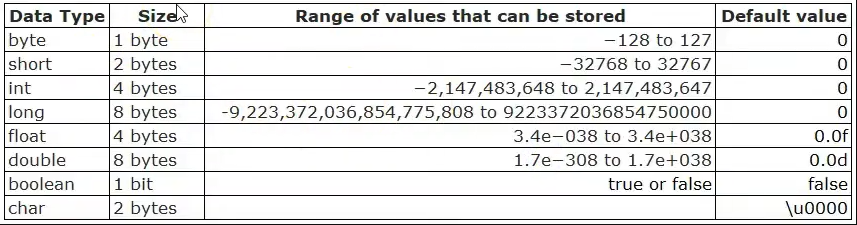

O repositório <b>AulasIniciais</b> foi criado para atualização do meu progresso ao aprender Java.

<h2> Aula 01: HelloWorld</h2>
A estrutura de um código é composta de:

- Declaração da Classe;
- Nome da Classe;
- Método.

Dentro do nosso método _public static void main(String[] args)_:

- **public static:** modificadores de acesso do método.
- **void:** tipo de retorno do método.
- **main:** nome do método.
- **String[] args:** parâmetros e argumentos do método.
- **System.out.println("Hello World");:** código.

Obs.: cada "{}" em um código é chamado de **bloco.**

Os nomes de classes são sempre iniciados em letra maiúscula e seguem o padrão _camel case_ para palavras compostas.
Por exemplo: AulaInicial, MediaEscolar, entre outros.

Dica: você pode usar o comando "psvm" no IntelliJ para criar o método <code>public static void main(String[] args)</code>.

<h2> Aula 02: TiposPrimitivos</h2>

Existem oito tipos primitivos no Java. São eles:
<code>int, double, float, long, char, short, byte e boolean</code>.

Diferente da criação de classes, as variáveis devem ser iniciadas SEMPRE com letra minúscula, mas ainda seguem o padrão _camel case_.
Por exemplo: idade, salarioAnual, somaMedia, entre outros.

Cada tipo primitivo tem sua respectiva função, sendo elas:

- **int e long:** armazenam números **inteiros não decimais.**
- **float e double:** armazenam números **decimais.**
- **byte e short:** armazenam valores números.
- **char:** armazena um caractere da tabela ASCII.

Cada variável armazena possui um tamanho em memória e um 'range' de valores que podem ser armazenados.

No mundo atual, os tamanhos de cara tipo primitivo acaba não importando muito, porém os valores que podem ser armazenados sim.

Por exemplo: Digamos que você declare a variável <code>short salario</code>, pode funcionar para uma certa porcentagem de pessoa, mas e para quem receber mais de R$32767? O programa irá emitir um erro. Então é muito importante que você pense no futuro ao se escolher o tipo de uma variável.

Algo interessante de se notar é que o tipo primitivo char possui tamanho de 2 bytes, e isso acontece porque os caracteres asiáticos maiores possuem um peso maior que uma letra romana.